# Architecture

The `@vitabletech/gbp-sdk` is designed with an enterprise-grade, clean architecture. It separates concerns strictly so that authentication, HTTP requests, and business logic are entirely decoupled.

## Core Flow

Here is a high-level overview of how a method call propagates through the SDK:

## 1. Services Layer
The `src/services/` directory contains classes corresponding to specific Google APIs (e.g., `AccountsService`, `LocationsService`). These classes do not know how authentication works; they simply format the URL and body and pass it to the `HttpClient`.

## 2. HTTP Layer
The `HttpClient` (`src/http/HttpClient.ts`) is responsible for executing network requests. 
It features:
- **Automatic Retries**: Implements exponential backoff via `RetryPolicy`.
- **Error Mapping**: Catches raw HTTP errors and maps them to domain-specific errors (e.g., mapping 429 to `RateLimitError`).
- **Timeout Management**: Wraps fetch requests with `AbortController` signals.

## 3. Token Manager Layer
Before the `HttpClient` fires a request, it asks the `TokenManager` for a valid access token.
The `TokenManager`:
- Checks `TokenStorage` (Memory or File) for an unexpired token.
- If expired or missing, it queues a refresh request via the `OAuthClient`.
- Ensures **thread safety**: if 5 simultaneous requests are fired while the token is expired, the `TokenManager` guarantees that only *one* refresh request is made to Google, and all 5 requests wait for that single refresh to complete.

## 4. OAuth Client
The `OAuthClient` strictly handles raw interactions with `oauth2.googleapis.com`. It handles generating authorization URLs and exchanging authorization codes or refresh tokens for active access tokens.
