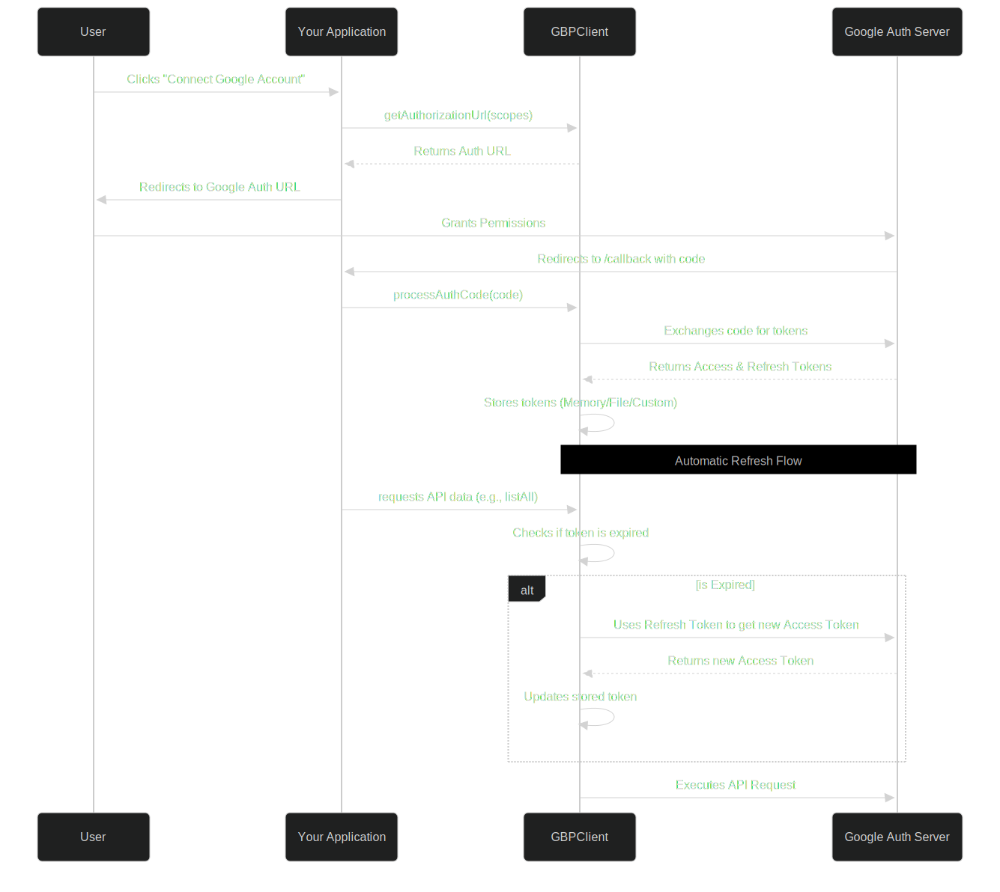

# Authentication (OAuth 2.0)

Every request to the Google Business Profile API must be authenticated using an OAuth 2.0 access token. 

The `@vitabletech/gbp-sdk` manages the entire lifecycle of these tokens for you. You do not need to manually check token expiration or refresh tokens—the SDK intercepts requests, checks token validity, and refreshes them seamlessly.

## The OAuth 2.0 Flow

Here is exactly how the authentication flow works in production:



## Security Considerations
> [!WARNING]
> Never hardcode your `clientSecret` or `refreshToken` directly in your source code. Always use Environment Variables (`.env`) or a secure secret manager.

## Generating the Auth URL

To authenticate a new user, you must first generate an Authorization URL and redirect them to it.

```typescript
import { GBPClient } from '@vitabletech/gbp-sdk';

const client = new GBPClient({
  clientId: process.env.GOOGLE_CLIENT_ID,
  clientSecret: process.env.GOOGLE_CLIENT_SECRET,
  redirectUri: 'http://localhost:3000/oauth/callback',
});

// Generate the URL
const scopes = [
  'https://www.googleapis.com/auth/business.manage'
];
const authUrl = client.getAuthorizationUrl(scopes, 'optional-state-string');

// Express.js example:
// res.redirect(authUrl);
```

## Processing the Callback

Once the user approves your app, Google redirects them back to your `redirectUri` with a `code` query parameter.

```typescript
// Example inside an Express.js route
app.get('/oauth/callback', async (req, res) => {
  const code = req.query.code as string;
  
  try {
    // This automatically fetches and stores the refresh/access tokens
    await client.processAuthCode(code);
    res.send('Successfully connected to Google!');
  } catch (error) {
    console.error('Authentication failed', error);
    res.status(500).send('Auth failed');
  }
});
```

## Initializing with an Existing Refresh Token

If you already have a `refreshToken` stored in your database for a user, you skip the steps above and initialize the client directly:

```typescript
const client = new GBPClient({
  clientId: process.env.GOOGLE_CLIENT_ID,
  clientSecret: process.env.GOOGLE_CLIENT_SECRET,
  refreshToken: '1//04fFgUZmEO-...', // Retrieve from your secure DB
  tokenStorage: 'memory'
});

// The SDK will automatically fetch a valid access token behind the scenes!
const accounts = await client.accounts.listAll();
```

## Inspecting Tokens (Token Info)

If you need to verify the validity of the current token, check its scopes, or see which Google Cloud App it belongs to, you can use the `getTokenInfo()` method.

The SDK will automatically use the current valid access token to query Google's `tokeninfo` endpoint.

```typescript
const tokenInfo = await client.getTokenInfo();

console.log('App ID:', tokenInfo.azp);
console.log('Scopes:', tokenInfo.scope);
console.log('Expires In (seconds):', tokenInfo.expires_in);
```

## Common Mistakes

> [!CAUTION]
> **Losing the Refresh Token**
> Google only provides a `refresh_token` the **very first time** a user authenticates. If you lose it and prompt the user to log in again, Google will *not* send a new one by default. You must store it securely upon `processAuthCode()`. If you need to force Google to issue a new one, you must include `prompt="consent"` in the authorization request parameters (handled automatically by our SDK in future updates, or configurable via custom auth options).
